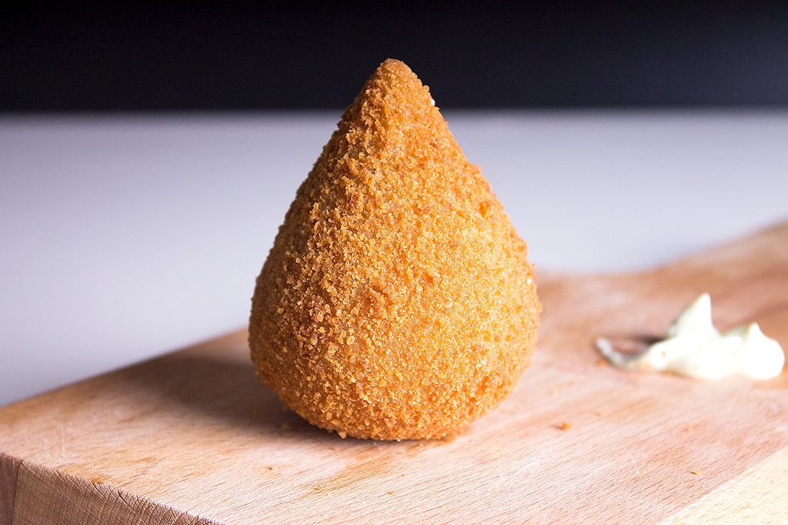

# Coxinha

Uma receita da família **Macena**

---

## Ingredientes

- 2 copos de água
- 1 copo de leite 
- 1 colher de margarina
- 1 cubo de caldo de galinha 
- sal a gosto
- 3 xícaras de trigo  

---

## Utensílios

- Panela Antiaderente
- Tigela 
- Escumadeira
- Espátula de silicone
- Frigideira funda

---

## Método de Preparação

### 1. Preparar a panela
Meter a água, o leite, a margarina, o caldo e o sal em uma panela e misture até ferver.

### 2. Controle do fogo
Abaixe o fogo e acrescente o trigo de uma só vez.

### 3. Mexer a massa
Mexa até obter uma massa lisa e homogênea

### 4. Rechear
Rechea da maneira que preferir

O resultado deve ser pequenas porções douradas e crocantes
---

## Notas

- A coxinha, na sua versão tradicional brasileira, com exterior dourado e crocante e um interior cuculento.
- Pode ser servida como entrada ou lanche, sendo sempre uma escolha irresistível.